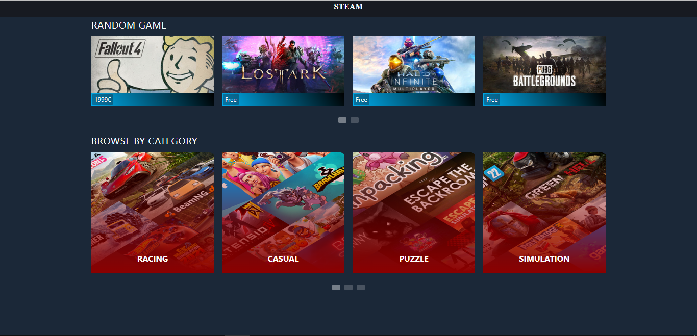

# 1. Introduction
This project is a personal project that imitate the [Steam web browser](https://store.steampowered.com/) but low effort.
[Demo for the website](https://stereact.000webhostapp.com/) is available.

# 2. Visual
The following section demonstrates some of the key visual of this project.

## 2.1 Home Page

The home page would look like this.

Currently, there are two sections in home page, "Random game" and "genre".

"Random game" section displays 20 games from the API randomly. When user click on one of them, the browser will navigate to the AppDetail page featuring that game.

"Genre" section displays fixed 13 genres. When one of them is clicked, the browser will send to Genre Page of the chosen genre. Some page will show empty, as the Steam Spy API doesn't have data for that genre.

## 2.2 AppDetail Page

The AppDetail Page would look like this.

## 2.3 Genre Page

The Genre Page would look like this.

## 2.4 Cart Page

The Cart Page would look like this.

## 2.5 Navbar and Footer

Navbar and Footer exist in all pages featured above.

Currently, Footer does not come with any function.

About Navbar, when user clicked on the 'STEAM' title, the browser will navigate to the home page.
If the user has some items in Cart, the Cart button wil appear on the right side of the homepage. When clicked, navigate user to the Cart Page with the cart items that user chose earlier intact.

# 3. Tech
